# 📱 UniTrack (iOS, SwiftUI)

UniTrack is a modern **student planner app** built with **SwiftUI** and **MVVM architecture**, using **Firebase Firestore** for real-time cloud storage and **local notifications** for reminders.  
It helps students organize courses, class schedules, assignments, and study sessions — all in one clean interface.


---

## 👩‍💻 Team
**Negar Pirasteh** • **Betty Dang** • **Ngoc Yen Nhi Pham**

---

## 🎯 Project Overview

UniTrack simplifies academic management for students.  
It allows users to:
- Plan and organize their **courses** and **weekly class sessions**  
- Track **assignments** and **exams** with automatic reminders  
- Log **study sessions** with a built-in **Pomodoro timer**  
- View progress in an intuitive **dashboard** synced with the cloud  

All data is stored in **Firebase Firestore** under each user's account and instantly updates across devices.

---

## ✨ Features

### 🗓️ Course & Schedule Management
- Add, edit, or remove **courses** with instructor details and color tags.  
- Add **class sessions** (weekday, start/end time, location).  
- Dashboard view of today's schedule.

### 🧾 Task & Exam Tracking
- Create **assignments** and **exams** linked to courses.  
- Mark tasks as complete or pending.  
- **Automatic reminders** via iOS local notifications.

### ⏱️ Pomodoro Study Timer
- Built-in 25/5 Pomodoro cycle for focused study sessions.  
- Logs every study session as a **StudyLog** with date and duration.

### ☁️ Cloud Sync (Firestore)
- All Courses, Sessions, Tasks, and StudyLogs stored in **Firebase Firestore**.  
- Organized under each user's UID:  
```

users/{uid}/courses/{courseId}
users/{uid}/sessions/{sessionId}
users/{uid}/tasks/{taskId}
users/{uid}/studyLogs/{logId}

```
- Uses **Firebase Authentication** (email or anonymous) to isolate user data.  
- Data syncs automatically when online.

### 📊 Progress Dashboard
- Shows percentage of completed tasks per course.  
- Displays “Due Soon” tasks and today’s schedule.  
- Optional **Swift Charts** graph of weekly study time.

---

## 📸 Screenshots (Student)

<table>
  <tr>
    <td align="center">
      <b>Sign Up</b><br>
      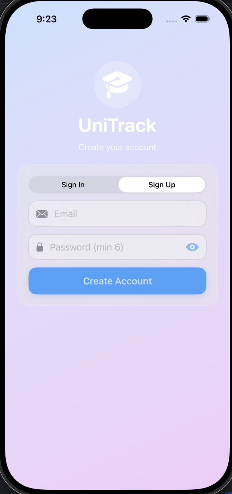
    </td>
    <td align="center">
      <b>Sign In</b><br>
      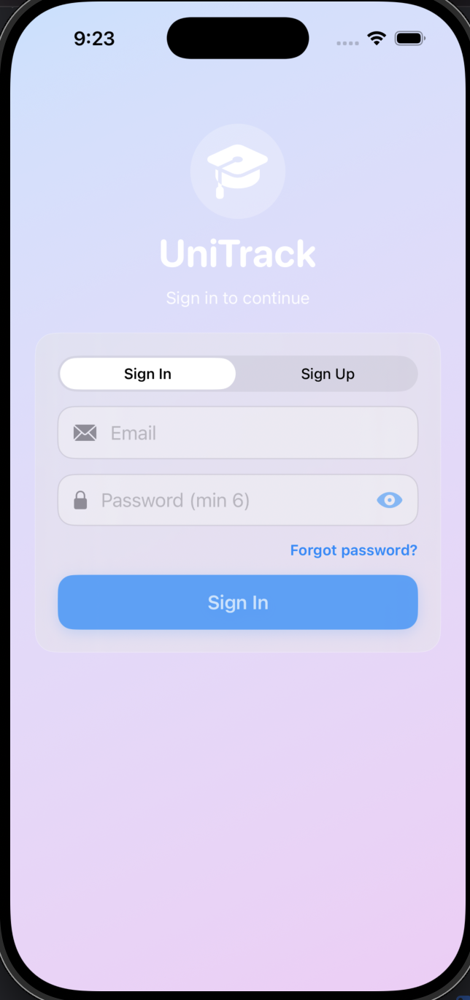
    </td>
    <td align="center">
      <b>Dashboard</b><br>
      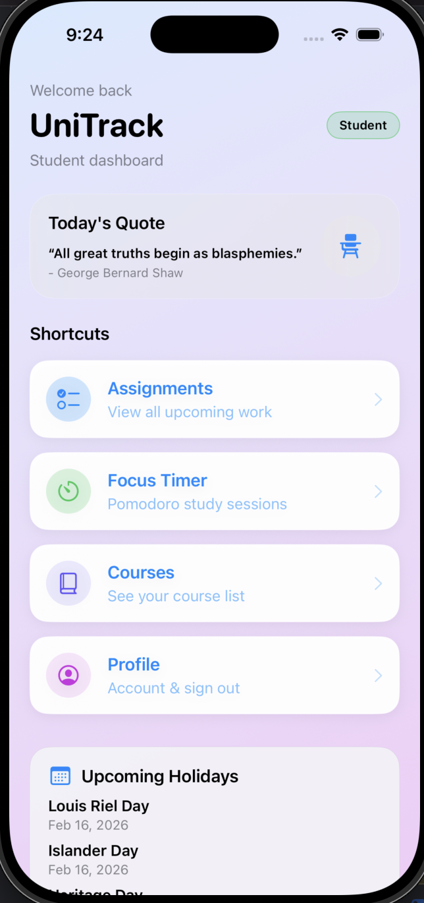
    </td>
  </tr>
  <tr>
    <td align="center">
      <b>Dashboard</b><br>
      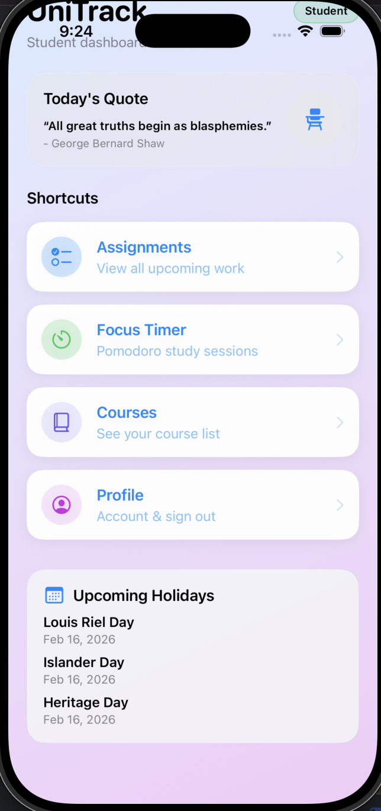
    </td>
    <td align="center">
      <b>Courses</b><br>
      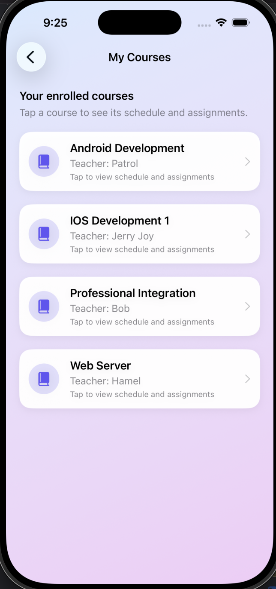
    </td>
    <td align="center">
      <b>Course Detail</b><br>
      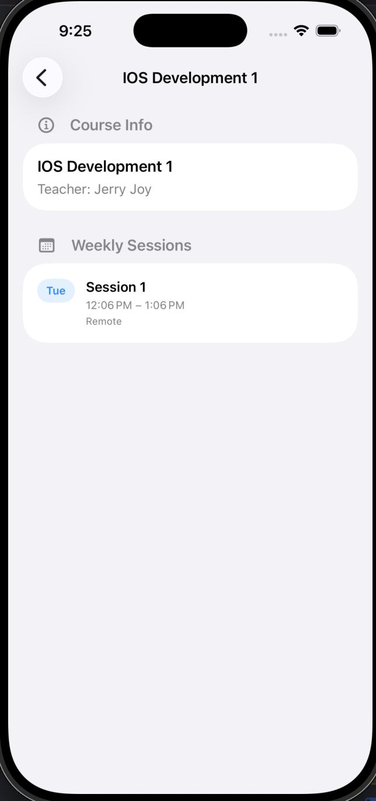
    </td>
  </tr>
  <tr>
    <td align="center">
      <b>Assignments</b><br>
      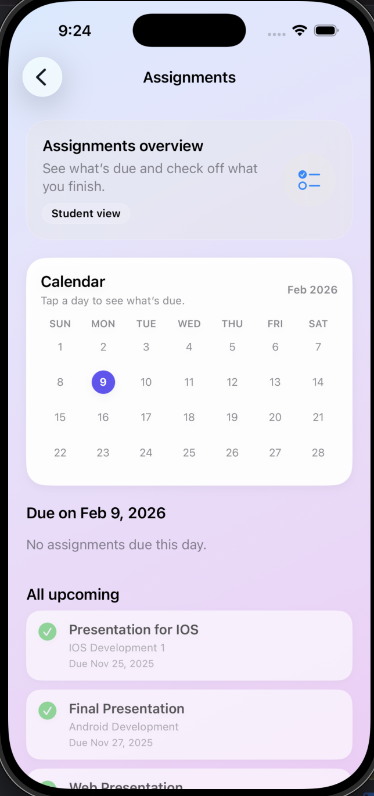
    </td>
    <td align="center">
      <b>Pomodoro</b><br>
      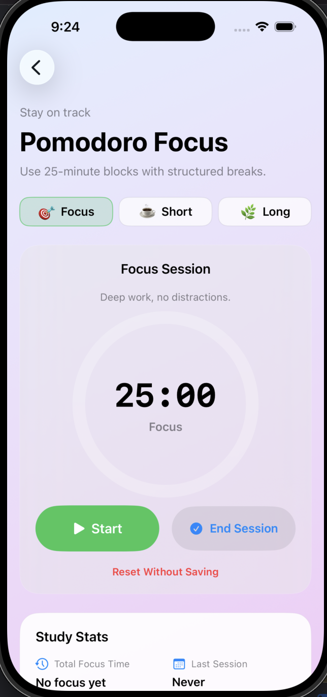
    </td>
    <td align="center">
      <b>Pomodoro</b><br>
      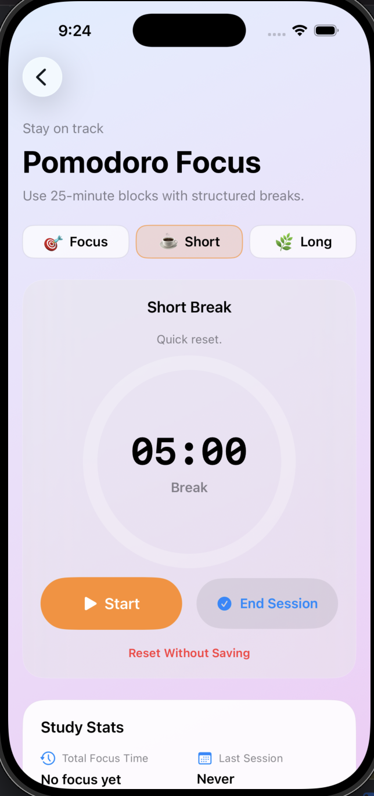
    </td>
  </tr>
  <tr>
    <td align="center">
      <b>Pomodoro</b><br>
      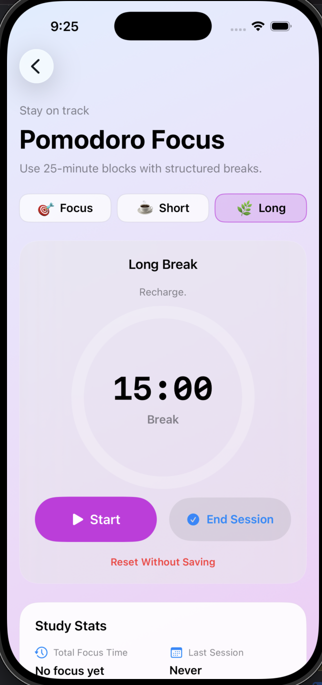
    </td>
    <td align="center">
      <b>Profile</b><br>
      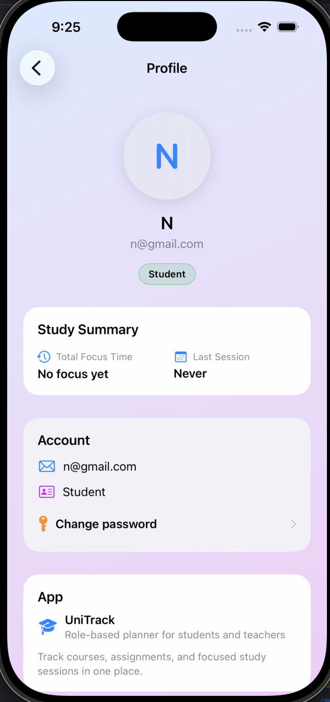
    </td>
    <td></td>
  </tr>
</table>


---

## 🧩 Architecture

**Pattern:** Model–View–ViewModel (MVVM)

```

SwiftUI Views  →  ViewModels  →  Repositories  →  Firebase Firestore
↘──  NotificationService

````

### Main Components
| Layer | Classes | Responsibility |
|-------|----------|----------------|
| **Model** | Course, Session, Task, StudyLog | Data structure & logic |
| **ViewModel** | CourseVM, TaskVM, TimerVM, DashboardVM | Handle app logic, connect models with UI |
| **Service** | NotificationService | Schedule and manage reminders |
| **Repository** | FirestoreRepository | CRUD operations with Firebase Firestore |
| **View** | SwiftUI screens | Display and bind data |

---

## 🗃️ Data Model Summary
| Entity | Attributes | Notes |
|--------|-------------|-------|
| **Course** | id, title, instructor, color | Has many sessions and tasks |
| **Session** | id, courseId, weekday, startTime, endTime, location | Belongs to one course |
| **Task** | id, courseId, type[assignment/exam], title, dueDate, isDone, weight | Belongs to one course |
| **StudyLog** | id, courseId, date, minutes | Created by Pomodoro timer |

---

## 🧱 Tech Stack
- **SwiftUI** — Declarative UI framework  
- **MVVM Architecture** — Clean separation of logic  
- **Firebase Firestore** — Real-time NoSQL cloud database  
- **Firebase Authentication** — Optional sign-in system  
- **UNUserNotificationCenter** — Local notifications  
- **Swift Charts** — Optional analytics graph  

---

## ⚙️ Setup & Installation

### Prerequisites
- Xcode 15 or later  
- iOS 17+ simulator or device  
- Active Firebase project

### Setup Steps
1. Clone this repo:
   ```bash
   git clone https://github.com/<your-user>/UniTrack.git
````

2. Open `UniTrack.xcodeproj` in Xcode.
3. Create a Firebase project at [Firebase Console](https://console.firebase.google.com/).
4. Enable **Firestore Database** and **Authentication (Email/Password or Anonymous)**.
5. Download your `GoogleService-Info.plist` file and drag it into the Xcode project (do not commit it to GitHub).
6. Add Firebase via Swift Package Manager:

   ```
   https://github.com/firebase/firebase-ios-sdk
   ```

   Include **FirebaseAuth** and **FirebaseFirestore**.
7. Build and run on a simulator or device.

---

## 🧮 Firestore Structure

```
users
 └── {uid}
      ├── courses
      │    └── {courseId}
      ├── sessions
      │    └── {sessionId}
      ├── tasks
      │    └── {taskId}
      └── studyLogs
           └── {logId}
```

Each user’s data is isolated and secured via Firestore security rules.

---

## 🔒 Firestore Security Rules (Sample)

```js
rules_version = '2';
service cloud.firestore {
  match /databases/{database}/documents {
    match /users/{userId}/{document=**} {
      allow read, write: if request.auth != null && request.auth.uid == userId;
    }
  }
}
```

---

## 🧩 Milestones (Course Schedule)

| Week        | Deliverable                              | Progress |
| ----------- | ---------------------------------------- | -------- |
| Week 8      | Proposal + UML diagrams + repo setup     | ✅        |
| Weeks 9–10  | Firestore setup + Course/Session CRUD    | 🔄       |
| Weeks 11–12 | Task CRUD + notifications + timer        | ⏳        |
| Weeks 13–14 | Dashboard + validation + optional charts | 🔜       |
| Week 15     | Final polish + README + demo             | 📦       |

---

## 🧪 Testing

Basic tests on ViewModels:

* Task creation & completion
* Firestore read/write
* Notification scheduling logic

---

## 📸 UML Diagrams

All diagrams are inside `/Docs/UML/`:

* Class Diagram
* Flowchart (Add Task)
* Activity Diagram (Notification)
* ER Diagram (Firestore structure)

---

## 🤝 Collaboration

### Branching

* `main` – stable version
* `feature/firebase` – Firestore integration
* `feature/tasks` – CRUD logic
* `feature/timer` – Pomodoro
* `ui/polish` – design refinement

Each teammate works in their feature branch → Pull Request → Review → Merge into `main`.

### Commit Style

Use simple, clear messages:

```
feat(tasks): add Firestore write
fix(timer): correct countdown display
docs: add class diagram to docs
```

---

## 🧭 Demo Plan (for presentation)

1. 1 min – Intro (goal + features)
2. 2 min – Show creating Course & Session
3. 1.5 min – Add Task → automatic reminder
4. 1.5 min – Run Pomodoro timer + progress view
5. 0.5 min – Firestore real-time sync and conclusion

---

## 📄 License

This project is released under the **MIT License** — free to use and modify.

---

## 🧠 Future Enhancements

* Multi-user sync (teachers / group projects)
* Dark mode and custom themes
* Widgets for “Today’s Tasks”
* iCloud backup and export

---

### ✨ Summary

**UniTrack** brings together scheduling, task tracking, and study logging into one intuitive iOS experience — powered by SwiftUI and Firebase.
It demonstrates strong architecture, teamwork, and cloud integration suitable for academic and real-world use.

```

